# Digital Library Management System


## Setup
Step-1:<br>
Add [application.properties](src/main/resources/application.properties)
 ```properties
## App Info
spring.application.name=digital-library-service

## Spring Data Source
spring.datasource.url=jdbc:mysql://localhost:3306/dbname
spring.datasource.username=root
spring.datasource.password=root

## Hibernate
## create-drop -> remove previous data, update -> update with previous data
spring.jpa.hibernate.ddl-auto=update
spring.jpa.show-sql=true
spring.jpa.properties.hibernate.format_sql=true

## JSON
spring.jackson.date-format=yyyy-MM-dd

## Redis
spring.cache.type=redis
spring.redis.host=localhost
spring.redis.port=6379
logging.level.org.springframework.cache=DEBUG

## Kafka
logging.level.org.springframework.kafka.listener=ERROR
logging.level.org.apache.kafka.clients.NetworkClient=ERROR
logging.level.org.apache.kafka.clients.consumer.internals.ConsumerCoordinator=ERROR
logging.level.org.apache.kafka.clients.consumer.ConsumerConfig=ERROR

## Transaction
transact.max_issue_allowed=2
transact.total_borrow_days=10

# Gmail SMTP Example
spring.mail.host=smtp.gmail.com
spring.mail.port=587
spring.mail.username=s...codejr@gmail.com
spring.mail.password=xxxx xxxx xxxx xxxx
spring.mail.properties.mail.smtp.auth=true
spring.mail.properties.mail.smtp.starttls.enable=true

# BCC recipients to keep track as ADMIN
email.bcc=admin.tracking@gmail.com
```
Step-2:<br>
Run [SpringBootLibraryApplication.java](src/main/java/com/sclab/library/SpringBootLibraryApplication.java) to start app.


### Important Note:

Before starting the Spring Boot application, ensure that the following components are active and configured properly:

1. **Database Configuration:**
    - Make sure your database server is running.
    - Check the application's `application.properties` or `application.yml` file for the correct database connection details.

2. **External Services:**
   Verify the availability and proper configuration of the external services the application depends on 
    - message brokers: Kafka
    - Caching: Redis

3. **Logging and Monitoring:**
    - Set up logging and monitoring tools as needed for tracking application behavior and performance.


## ER Diagram


## C4 Diagram

```mermaid
---
title: C4 Diagram
---
flowchart TD
    Student[/"👤\n Student"\]:::person
    TechnicalPerson[/"👤\n Developer"\]:::person
    Admin[/"👤\n ADMIN"\]:::person
    Gmail[["📧\n Gmail APP"]]:::externalApp
    TechnicalPerson -- test - crud --> PostMan
    Admin -- use - crud --> Client
    Admin -- use - crud --> WebApp
    Admin -- use - crud --> MobileApp
    Student -- use - r --> Client
    Student -- use - r --> WebApp
    Student -- use - r --> MobileApp
    Gmail -- receive email --> Student

    subgraph ClientApp[Client Apps - UI]
        PostMan[["PostMan Testing Tool"]]:::externalSystem
        Client[["Client App"]]:::externalSystem
        WebApp[["Web App"]]:::externalSystem
        MobileApp[["Mobile App"]]:::externalSystem
    end
    subgraph Controller
        PostMan -- interact --> TestController
        Client -- interact --> AuthorController
        Client -- interact --> BookController
        Client -- interact --> AssignAuthorBookController
        MobileApp -- interact for book ISSUE/RETURN --> TransactionController
        MobileApp -- interact --> StudentController
        MobileApp -- interact --> CardController
        WebApp -- interact --> ReportController
    end
    subgraph ApiService["API service"]
        AuthorController -- interact --> AuthorService
        BookController -- interact --> BookService
        AssignAuthorBookController -- interact --> AssignAuthorBookService
        StudentController -- interact --> StudentService
        CardController -- interact --> CardService
        TransactionController -- interact --> TransactionService
        ReportController -- interact --> TransactionService
        ReportController -- interact --> StudentService
    end
    subgraph RedisServer[RedisServer]
        Redis[("Redis Storage")]:::dataStorage
    end
    subgraph Repository
        AuthorService -- create --> AuthorRepository
        BookService -- interact --> BookRepository
        AssignAuthorBookService -- interact --> AuthorBookRepository
        StudentService -- interact --> StudentRepository
        CardService -- interact --> CardRepository
        TransactionService -- interact --> TransactionRepository
        AuthorService -- Cacheable/get --> Redis
        Redis -- CachePut/update , CacheEvict/delete --> AuthorRepository
    end
    subgraph Entity["Database"]
        AuthorRepository -- crud --> AuthorEntity["Author Table"]
        BookRepository -- crud --> BookEntityEntity["BookEntity Table"]
        AuthorBookRepository -- crud --> AuthorBookEntity["AuthorBook Table"]
        StudentRepository -- crud --> StudentEntity["Student Table"]
        CardRepository -- crud --> CardEntity["Card Table"]
        TransactionRepository -- crud --> TransactionEntity["Transaction Table"]
        User
    end
    Entity:::dataStorage
    subgraph KafkaService["Kafka-Mail-Notification-Sender service"]
        KafkaListenerService -- sendSimpleEmail --> EmailService
        CardService -- getById --> KafkaListenerService
        TransactionService -- send issue or return notification ---> KafkaProducerService
        KafkaProducerService -- produce notification --> Kafka
        Kafka[("Kafka MQ")]:::dataStorage -- consume notification --> KafkaListenerService
    end
    KafkaService:::internalSystem
    EmailService -- Send notification email to --> Gmail
%% Element type definitions
    classDef person fill: #08427b, color: #fff
    classDef internalSystem fill: #1168bd, color: #fff
    classDef externalSystem fill: #4040bd, color: #fff
    classDef externalApp fill: #300000, color: #fff
    classDef dataStorage fill: #777700, color: #fff
```




## Grafana dashboard
- Run Docker to host prometheus and grafana
- Open [Grafana Dashboard](http://localhost:3000/dashboards)
- Check existing template [here](http://localhost:3000/dashboards)
- If template not visible or want new one, import template
   - Click `+` and select `Import Dashboard` or visit [import page](http://localhost:3000/dashboard/import)
   - Put template code(`11378`) under `Import via grafana.com`. Template details: [11378](https://grafana.com/grafana/dashboards/11378-justai-system-monitor/)
   - Click Import


## References
 - [Spring Docs](https://spring.io/guides)
 - [JPA query-methods-details](https://docs.spring.io/spring-data/jpa/reference/repositories/query-methods-details.html)
 - [JPA query-methods](https://docs.spring.io/spring-data/jpa/reference/jpa/query-methods.html)
 - [Unit Test Sample Code](https://github.com/in28minutes/spring-unit-testing-with-junit-and-mockito)
 - [Monitor setup](https://medium.com/simform-engineering/revolutionize-monitoring-empowering-spring-boot-applications-with-prometheus-and-grafana-e99c5c7248cf)
 - [Exception Priority Set](https://stackoverflow.com/questions/40334360/how-to-set-priority-in-exceptionhandling-via-controlleradvice)
 - [mermaid flowchart](https://lukemerrett.com/building-c4-diagrams-in-mermaid/)
 - [mermaid flowchart official](https://mermaid.js.org/syntax/flowchart.html)
